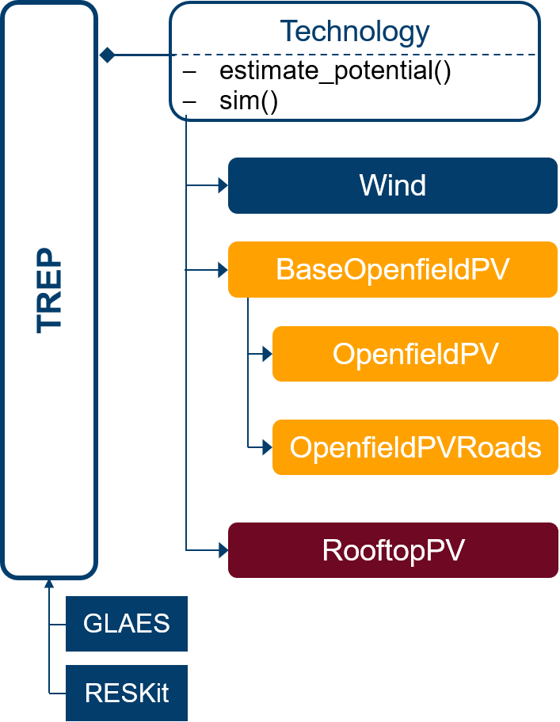

# Tool for Regional Renewable Potentials (TREP)

## Setup TREP in developer mode
Clone this repo:
```
cd <your path>
git clone https://jugit.fz-juelich.de/iek-3/groups/urbanmodels/TREP.git
```
Create conda environment from yml file
```
conda env create --file <your path>\trep\requirements-dev.yml
```
Clone and install the following repositories
1. [Geokit](https://jugit.fz-juelich.de/iek-3/shared-code/geokit) (dev branch)
```
cd <your path>
git clone https://jugit.fz-juelich.de/iek-3/shared-code/geokit.git
cd <your path>\geokit
git checkout dev
pip install -e .
```
2. [GLAES](https://jugit.fz-juelich.de/iek-3/shared-code/glaes) (issue8_existingItems branch)

As the existing items are branched for now, we need to checkout issue8_existingItems
```
cd <your path>
git clone https://jugit.fz-juelich.de/iek-3/shared-code/glaes.git
cd <your path>\glaes
git checkout issue8_existingItems
pip install -e .
```
3. [RESKit](https://jugit.fz-juelich.de/iek-3/shared-code/reskit) (dev branch)
```
cd <your path>
git clone https://jugit.fz-juelich.de/iek-3/shared-code/reskit.git
cd <your path>\reskit
git checkout dev
pip install -e .
```
4. [FINE](https://github.com/FZJ-IEK3-VSA/FINE) (dev branch)
```
cd <your path>
git clone https://github.com/FZJ-IEK3-VSA/FINE.git
cd <your path>\fine
git checkout dev
pip install -e .
```
4. [MATES](https://jugit.fz-juelich.de/iek-3/shared-code/mates)
```
cd <your path>
git clone https://jugit.fz-juelich.de/iek-3/shared-code/mates.git
cd <your path>\mates
pip install -e .
```
#### Install TREP
```
cd <your path>\trep
git checkout dev
pip install -e .
```
## Structure
The structure is visualized below. The technologies are properties of the TREP class. Therefore, TREP can be used to handle all technologies and to estimate potentials and simulate modules. All technologies have a function estimate_potential(exclusion_dict) and sim() which fill the properties predicted_items and ts_predicted_items. The estimate_potential has a default exclusion run for the federal states of Germany (right now only NRW and Thuringia). Nevertheless, if you want to specify a manual exclusion you can alter the exclusion_dict or run an exclusion from a [config file](## Config files).
Additionally, existing items are part of the analysis and are properties (existing_items, ts_existing_items) of the classes Wind, OpenfieldPV (also at the sides of Roads) and RooftopPV. 




## Data
### LoD2
### MaStR

## Config files
The data folder includes a [config](trep/data/config) directory in which json files with can be used to parameterize the exclusions. The default exclusions are already uploaded and are ready to use. The files consist of keywords paired with a buffer distance (e.g. {'urban': 1000}, which means a distance of 1000m to urban settlements). New config files can be created and loaded or dictionaries can be directly used in the code.  

## Examples
A simple example of an example workflow can be found [here](examples/e_simple_workflow.ipynb).
